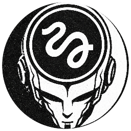

<p align="center">
  
</p>

<h1 align="center">Influencer character creator</h1>

Two agent skills to create viral cartoon/caricature-style characters translated into real people with photographic realism, and to generate their continuity sheet.

**Works with:** Claude Code · Higgsfield · Nano Banana · GPT Image · Midjourney · Flux

## Skills

| Skill | What it does |
|---|---|
| `/live-action-character` | Creates the character and delivers a single image generation prompt. |
| `/live-action-character-sheet` | Generates the character sheet prompt: front, 3/4, profile and back views, plus close-ups of face, eyes, hands, prop and costume. |

## Install

As a Claude Code plugin (run inside Claude Code):

```bash
/plugin marketplace add gustamdev/influencer-character-creator
/plugin install influencer-character-creator@influencer-character-creator
```

Or copy the folders into `~/.claude/skills/` from the repository root:

```bash
cp -R skills/* ~/.claude/skills/
```

## Usage

1. Ask for a character with `/live-action-character` and generate the image from the prompt.
2. Run `/live-action-character-sheet` to get the character sheet and keep the character consistent.
